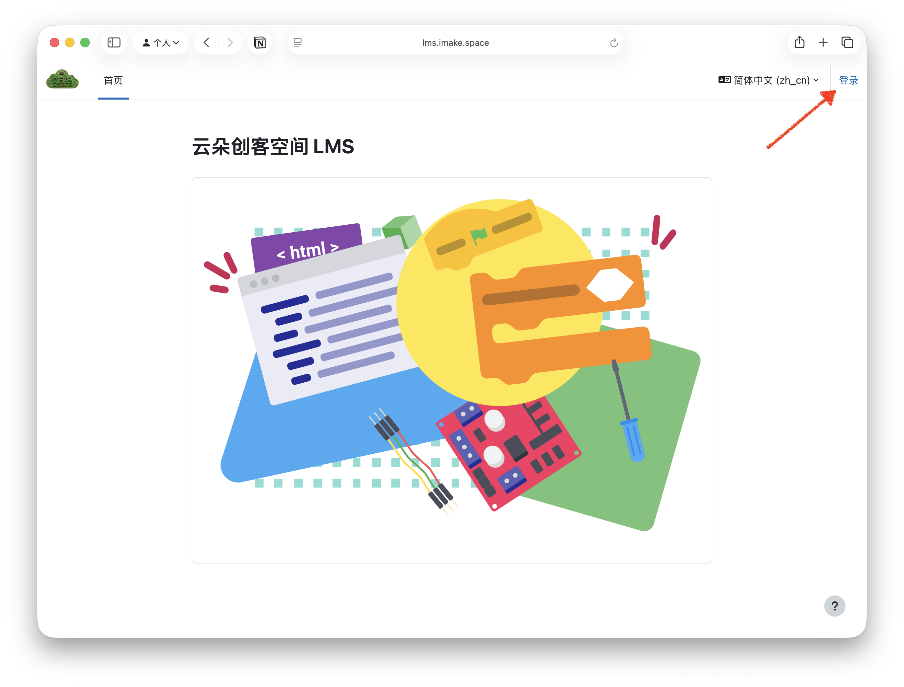
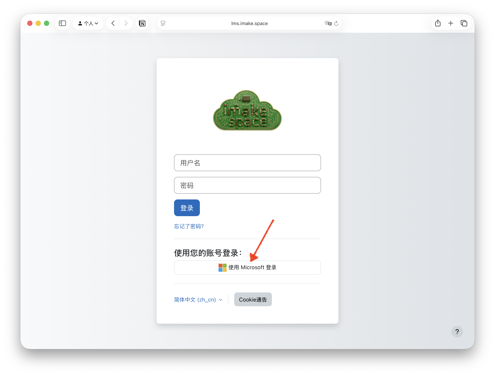
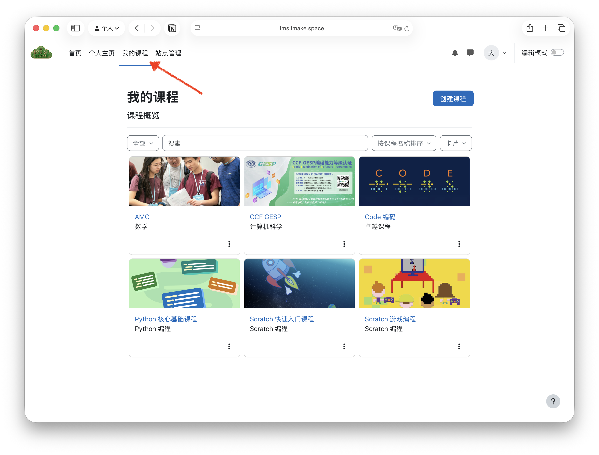

## 什么是 LMS？
LMS（Learning Management System，学习管理系统）是一个在线平台，旨在帮助学生和教师管理课程内容、跟踪学习进度以及促进交流与协作。云朵创客空间的 LMS 提供了丰富的资源和工具，支持各种学习活动。

## 如何使用云朵创客空间的 LMS
1. **访问 LMS 平台**  
   - 打开浏览器，直接访问 [云朵创客空间 LMS](https://lms.imake.space/)。https://lms.imake.space

   - 或者通过云朵创客空间网站 [云朵创客空间](https://imake.space/) 导航到“LMS 学习管理系统”部分。
2. **登录**  
   - 点击页面右上角的“登录”按钮。
   
   - 选择“使用 Microsoft 登录”。
   
3. **浏览课程**  
   登录后，您可以点击导航栏的“我的课程”，浏览可用的课程列表。点击感兴趣的课程以查看详细信息。
   
4. **参与学习活动**  
   进入课程后，您可以查看课程材料、完成作业、参加讨论以及与教师和同学互动。
5. **跟踪进度**  
   LMS 提供了进度跟踪功能，帮助您了解自己的学习进展和需要完成的任务。