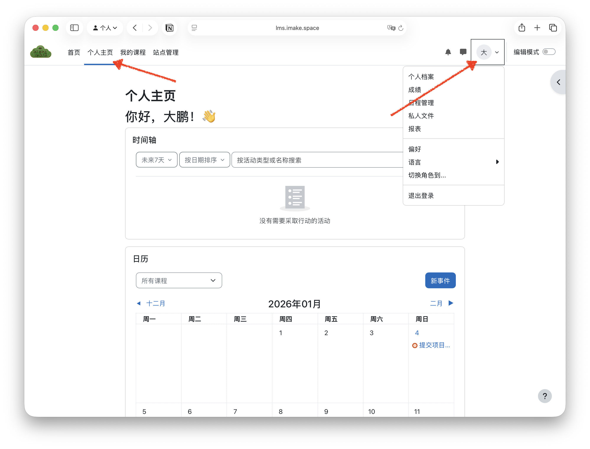
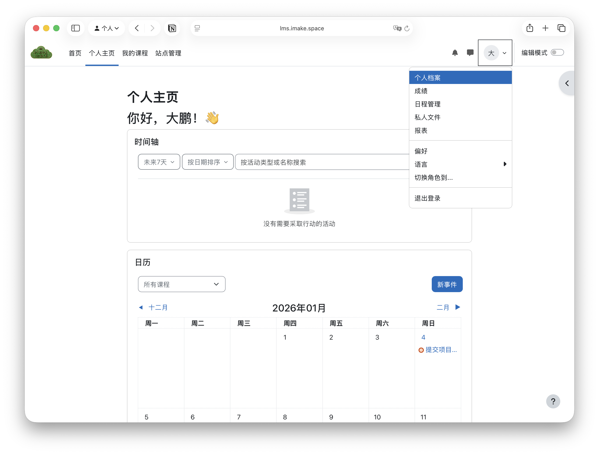
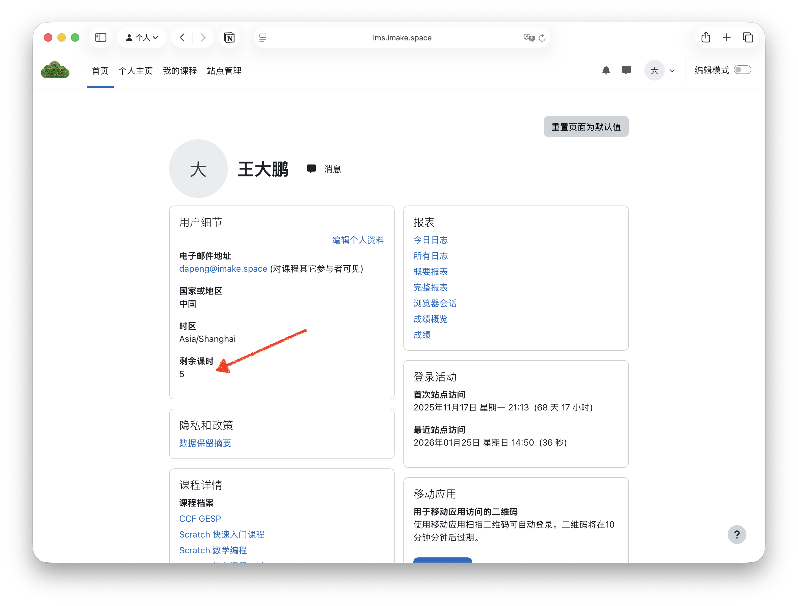

## 查看剩余课时的步骤
1. **登录 LMS 平台**
参考[如何登录 LMS](/guides/lms/getting-started/)中的步骤登录到 LMS。
2. **进入“个人主页”页面**
登录后，点击右上角的头像图标，然后选择“个人主页”。

3. **查看“个人档案”页面**
在个人菜单中选择“个人档案”选项。

4. **查找剩余课时信息**
在“个人档案”页面中，您可以看到有关您的剩余课时详细信息。

