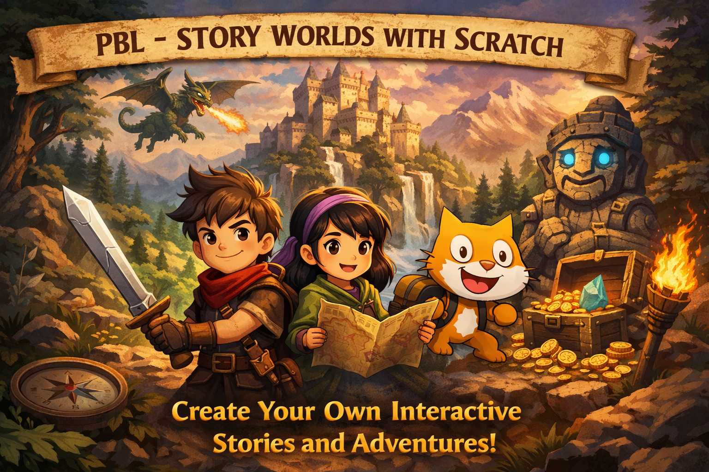
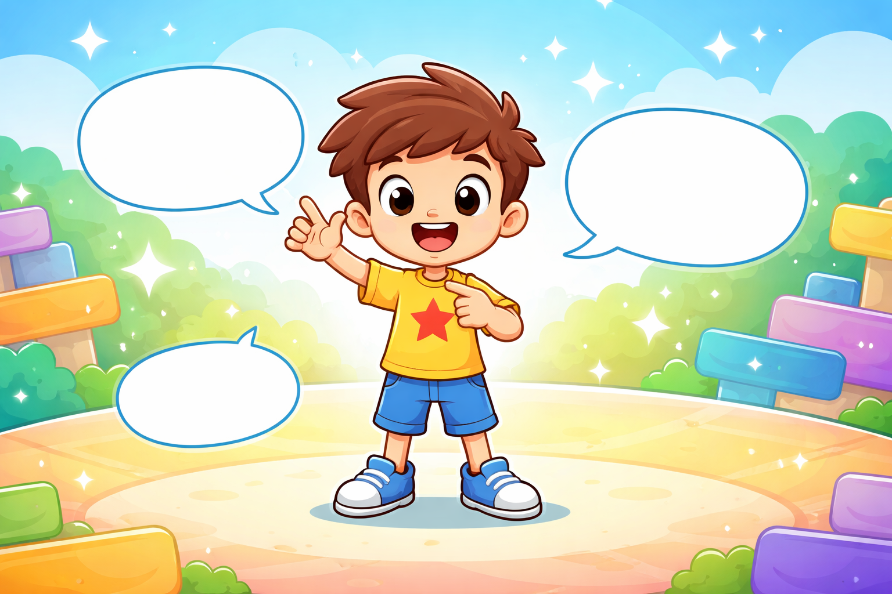
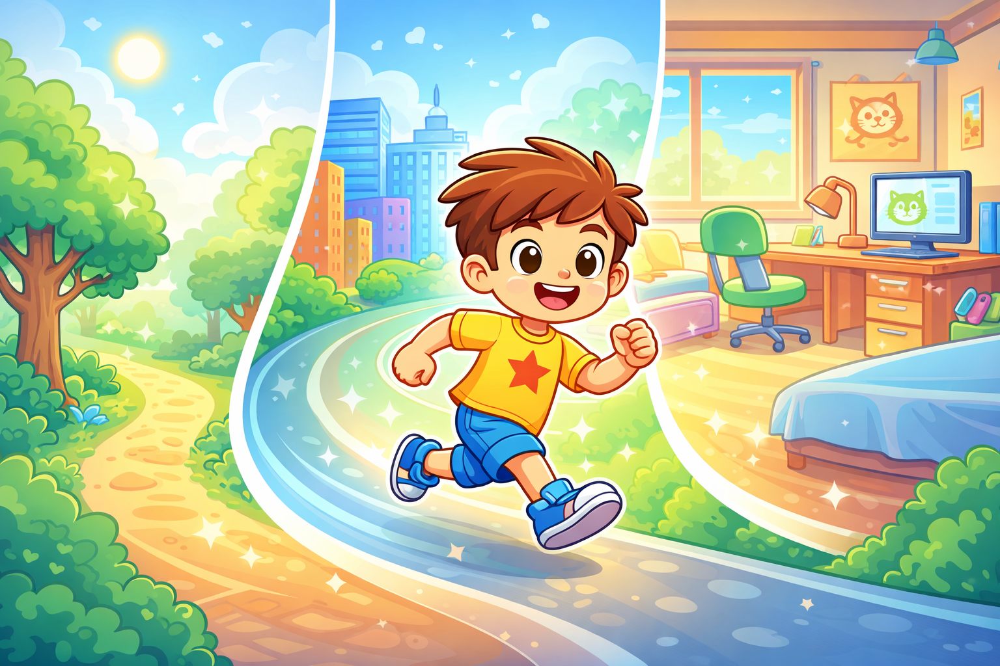
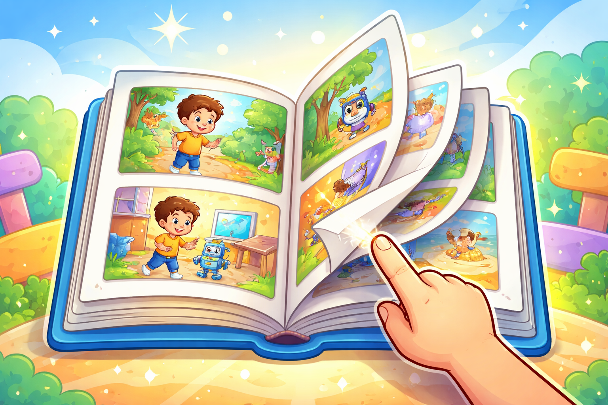
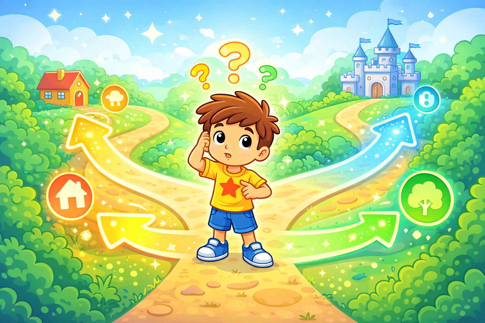
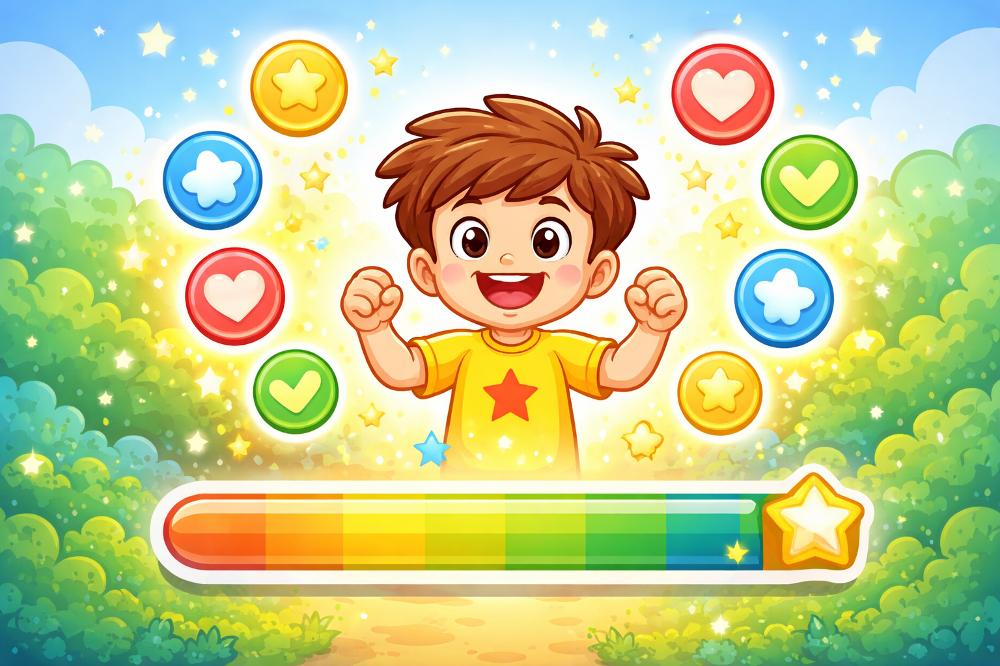
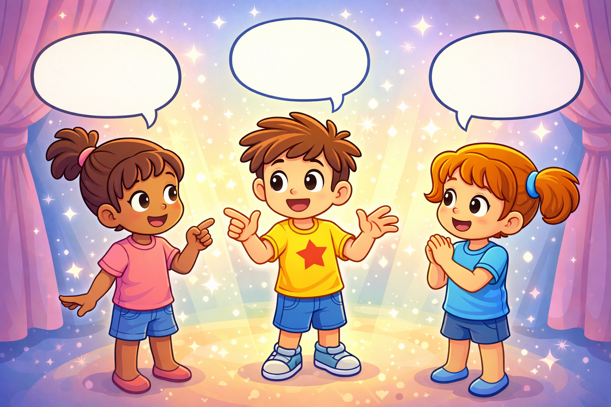
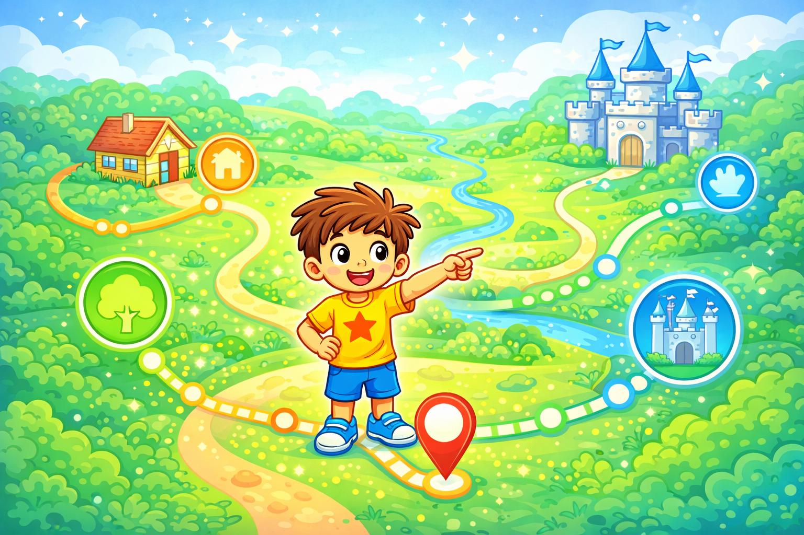
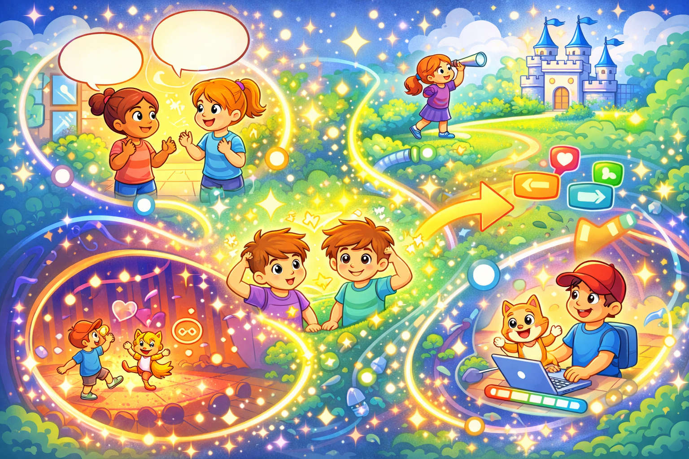

---

## Project 1｜我的动画名片

🍔 **课程概述：**

每个人都有自己的故事，而这一切从认识自己开始。在第一个项目中，同学们将制作一张"会动的自我介绍"——不是一张静静躺在纸上的名片，而是一个能说话、会动、有表情的数字角色。我们将学习如何在 Scratch 舞台上创建角色、设计造型、让角色按照顺序说出自己想说的话。整个项目的核心问题只有一个：如果你的自我介绍能动起来，你想让它说什么、做什么？同学们需要设计角色的外形、编写至少三句台词、为每句话配上对应的动作或表情变化，并加入背景来营造氛围。这是我们在 Scratch 故事世界里的第一件作品，也是整个 Season 的起点。完成后，每位同学都将拥有一张独一无二、只属于自己的动画名片。

🎯 **课程目标：**

- 认识 Scratch 界面的基本组成：舞台、角色、造型、背景、积木区
- 掌握"说出"与"思考"积木的使用，理解顺序执行的概念
- 能够通过切换造型让角色产生动作变化
- 学会使用"等待"积木控制台词之间的节奏
- 完成第一个有完整开头和结尾的 Scratch 作品

---

## Project 2｜一镜到底小短片

🍔 **课程概述：**

好的故事需要结构。在这个项目中，同学们将学习所有故事最基本的骨架——三幕结构：开始、经过、结尾。我们的任务是创作一段"一镜到底"的动画短片，有明确的起点和终点，中间有事情发生，最后有一个交代。不同于第一个项目的"自我展示"，这次我们要讲一件事：可以是一次冒险、一个小误会、一个有趣的日常场景。同学们需要提前用纸笔画出三格分镜，规划好每一幕的场景和角色行为，然后在 Scratch 中用背景切换和角色动作来实现这个故事。这个项目的重点是时序——让每一件事在正确的时间发生。完成后，你将拥有一段真正意义上的"动画短片"，而不只是一段会动的画面。

🎯 **课程目标：**

- 理解三幕叙事结构（开始、经过、结尾）并能将其应用于创作
- 掌握多背景切换的实现方法
- 能够精确使用"等待"积木控制动作和场景的时序
- 学会让角色在不同场景中有不同的行为表现
- 体验从纸上分镜到数字作品的完整创作流程

---

## Project 3｜翻页故事绘本

🍔 **课程概述：**

绘本和动画的最大区别，在于"谁来决定翻页"。在这个项目中，我们要把主动权交给观众——制作一本需要点击才能翻页的互动故事绘本。同学们将创作一个至少五页的故事，每一页有独立的画面和台词，观众点击后才会进入下一页。这个看似简单的改变，实际上引入了编程中非常重要的一个概念：事件驱动。程序不再自动往下走，而是等待一个"触发"才继续。我们需要设计每一页的内容，包括背景、角色位置、台词，并用点击事件将它们串联起来。完成后，同学们将拥有一本真正可以"翻阅"的数字绘本，可以分享给家人阅读。

🎯 **课程目标：**

- 理解"事件驱动"编程的核心概念：程序等待触发才继续执行
- 掌握点击事件（绿旗、角色点击）的使用方式
- 能够设计并实现多页绘本的翻页逻辑
- 学会让角色和背景在同一页面内协同呈现
- 体验为真实"读者"设计内容的观众意识

---

## Project 4｜你来决定结局

🍔 **课程概述：**

普通故事只有一个结局，但互动故事可以有很多种。这个项目是整个 Season 的核心转折点——我们将创作第一个真正意义上的"分支故事"：观众在故事进行到某个节点时，需要做出选择，而不同的选择会带来不同的走向和结局。同学们需要先用流程图在纸上规划故事的分支结构，再在 Scratch 中用"询问并等待"和"如果…那么…否则"积木来实现：程序问观众一个问题，根据回答决定故事怎么走。这是我们第一次让程序"思考"——根据条件做出不同的决定，这正是所有智能程序的基础。完成后，你的故事将拥有至少两条路径和三种结局，每一位观众的体验都可能不同。

🎯 **课程目标：**

- 掌握"询问并等待"积木，理解用户输入的获取方式
- 理解并能正确使用条件判断积木（如果…那么…否则）
- 能够用流程图规划分支叙事结构，并将其转化为 Scratch 程序
- 实现至少两条分支路径和三种不同结局
- 体验条件逻辑在互动叙事中的核心作用

---

## Project 5｜记住你的选择

🍔 **课程概述：**

好的故事会记住你说过的话。在上一个项目中，每次重新开始游戏，故事都"忘记"了你之前做过什么。这一次，我们要让故事拥有记忆——用"变量"记录观众在故事前半段做出的选择，并在后半段根据这些积累起来的选择呈现不同的结局。这就像生活中的选择一样：早期的一个决定，往往在很久之后才能看到它的影响。同学们需要设计一套"选择计分"系统：不同的选择给变量加上不同的值，故事结尾时根据变量的总值判断走向哪个结局。这个项目将让同学们深刻理解"变量"究竟是什么，以及为什么它是编程中最重要的概念之一。

🎯 **课程目标：**

- 理解变量的概念：用于存储和追踪会变化的信息
- 能够创建变量并在不同场景中对其进行读取和修改
- 掌握根据变量值判断结局的逻辑设计
- 体验"伏笔与回响"的叙事手法：早期选择影响后期结果
- 对比项目 4 理解"有记忆的故事"与"无记忆的故事"的本质区别

---

## Project 6｜多角色对话剧场

🍔 **课程概述：**

真实的故事里，不只有一个声音。在这个项目中，我们要创作一个有三个以上角色、能够真实"对话"的戏剧场景。挑战在于：Scratch 中每个角色都是独立的，它们不会自动知道"现在轮到我说话了"。我们需要用一种叫做"广播"的机制，让角色之间能够互相传递信号：角色 A 说完话，广播一个消息；角色 B 收到消息，知道该自己出场了。这个概念在真实的软件开发中被广泛使用，叫做"事件驱动通信"。同学们需要先写好对话脚本，再思考每一句话结束后应该触发什么。完成后，你的作品将是一个真正有来有回、节奏自然的数字剧场，甚至可以加入隐藏对话等待观众发现。

🎯 **课程目标：**

- 理解并掌握广播与接收积木的使用方式
- 能够用广播机制实现多角色之间的顺序对话
- 学会通过动作和造型切换配合台词，增强角色表现力
- 体验剧本写作与程序实现之间的转化过程
- 理解"事件驱动通信"在多角色协作中的作用

---

## Project 7｜我的故事地图

🍔 **课程概述：**

前六个项目的故事都是线性的——观众沿着一条路（或几条路）走到终点。但真实的世界是可以自由探索的。在这个项目中，我们要创作一个有地图的故事世界：观众可以看到整张地图，选择想去的地方，进入那个地点探索独有的内容，然后返回地图继续旅行。同学们需要设计一张包含四到六个地点的地图，为每个地点创作独立的场景和内容，并用列表来储存和管理这些信息。这个项目模拟的是真实游戏和应用的核心架构：主界面导航 + 子场景内容 + 返回机制。完成后，你的作品将是一个真正意义上的"可探索世界"，每位观众的游览路线都可以完全不同。

🎯 **课程目标：**

- 理解列表的概念，能够用列表储存和读取多个地点的信息
- 掌握场景作为状态的设计思路：主地图与子场景之间的切换逻辑
- 能够实现"进入地点 → 探索内容 → 返回地图"的完整导航流程
- 学会在多个地点中埋入与主线相关的线索或彩蛋
- 体验开放式叙事结构与线性叙事结构的设计差异

---

## Project 8｜毕业作品：我的互动故事

🍔 **课程概述：**

这是整个 Season 的压轴项目，也是每位同学独立创作的毕业作品。经过前七周的学习，你已经掌握了顺序执行、事件驱动、条件判断、变量、广播、列表等核心编程概念，以及独白、三幕结构、翻页绘本、分支叙事、对话剧场、开放地图等多种故事形式。现在，是时候把这些工具都交还给你，让你创作一个完全属于自己的互动故事。这个故事的主题、形式、长短、风格，全部由你决定。唯一的要求是：它需要是互动的，观众的参与要能影响故事的走向或体验；并且它需要至少运用两种我们学过的技术。第三节课，我们将举行一场故事发布会，每位同学向全班展示自己的作品，分享一个自己在创作过程中做出的设计决策。

🎯 **课程目标：**

- 综合运用 Season 全部编程概念完成一件完整的原创作品
- 能够从用户需求出发进行功能规划，并写出清晰的项目策划书
- 独立完成从构思、实现到测试的完整创作流程
- 学会在公开场合介绍自己的作品并解释设计决策
- 回顾整个 Season 的学习历程，建立对自身成长的认知
